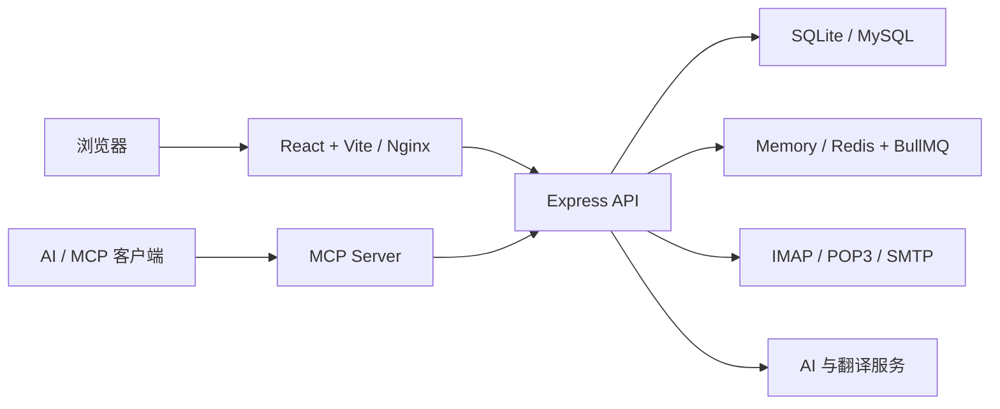

<p align="center">
  
</p>

<h1 align="center">Submail</h1>

<p align="center"><strong>自托管的多邮箱聚合工作台，同时提供 AI 邮件助手、MCP 和 HTTP 发信 API。</strong></p>

Submail 面向单实例自托管场景：通过 IMAP 或 POP3 集中收取邮件，通过已添加邮箱的 SMTP 发信，并向外部 AI / Agent 提供带细粒度权限控制的远程 MCP 能力。

数据层支持 SQLite、Docker Compose 内置 MySQL 和外部 MySQL；Docker 部署使用 Redis + BullMQ 承载同步与 SMTP 发送任务。本机开发默认使用 SQLite + 内存队列，不启动容器也能调试。

[功能](#已有能力) · [架构](#系统架构) · [快速开始](#快速开始) · [Docker 部署](#docker-一键部署) · [MCP](#mcp) · [HTTP API](#http-发信-api) · [安全边界](#数据和安全边界)

## 已有能力

- 多邮箱管理：新增、编辑、删除、备注、IMAP/POP3/SMTP 连接测试；按邮箱后缀识别 Gmail、Outlook、QQ、网易、iCloud、Yahoo、Zoho 等常见服务商并提供推荐参数；邮箱密码使用 AES-GCM 加密保存；同一真实邮箱可维护多个自有地址/发信身份，别名通过一次性验证码确认后才可用于 Send As。
- 邮件同步：IMAP 使用 UID 增量同步 INBOX 与服务器“已发送”目录；POP3 使用 UIDL 增量去重、只读收件箱且不删除服务器邮件；支持首次同步数量、定时任务、失败重试、并发限制和同步日志。同步记录支持分页、手动删除和按保留天数自动清理。已读、归档等状态保存在 Submail 本地，不反向修改邮箱服务器。
- 集中处理：统一收件箱、独立邮件对话模式、收发件人信息、草稿、回复/转发、星标、归档、垃圾箱和批量处理；对话优先按 Message-ID / In-Reply-To / References 聚合，再以同一联系人和规范化主题兜底，不依赖邮箱别名。桌面端账号栏、邮件列表和长正文分别滚动。
- 附件管理：使用 Flyfish File Viewer 全量预览 Office、PDF、压缩包、邮件等常见格式；附件只在手动点击时下载，原始 `.eml` 邮件会在正文下方自动解析，并支持分页和按天自动删除。
- 邮件发送：文本、HTML、CC/BCC、附件和线程头；成功后写入本地 Sent，并支持 Idempotency-Key 防止重复投递。
- AI：配置任意 OpenAI-compatible `chat/completions` 服务，支持邮件总结、推荐回信和邮件生成；AI 生成内容只进入编辑器，不会自动发送。
- 翻译：默认提供免 Key 的 Google 翻译兼容接口，也可选择 LibreTranslate 或自定义 HTTP 服务；长邮件会完整分块翻译。
- MCP 与 API：stdio、远程 Streamable HTTP MCP 和 HTTP 发信 API 共用一套 Key；可限制 scope、邮箱账号、有效期和每日发信量。
- 运维：Docker Compose 一键部署、Redis 持久化队列、SQLite/内置 MySQL/外部 MySQL、健康检查、最小权限容器、SQLite 在线备份/原子恢复和日志保留策略。

## 系统架构



| 模块 | 技术与职责 |
| --- | --- |
| Web | React 19、Vite 6、TypeScript；邮件管理、设置后台与附件预览 |
| API | Node.js、Express、Knex；认证、邮件同步/发送、AI、翻译与备份恢复 |
| 邮件 | ImapFlow、node-pop3、Nodemailer 和 Mailparser |
| 数据 | SQLite WAL / FTS5，或 MySQL 8 |
| 队列 | 本地开发使用内存队列；Docker 使用 Redis + BullMQ |
| MCP | 官方 MCP SDK，支持 stdio 与 Streamable HTTP |

## 快速开始

需要 Node.js 22+：

```bash
npm ci
npm run secure:local
npm run dev
```

- Web：`http://localhost:5173`
- API：`http://localhost:8787`
- 本地数据：`apps/api/data/submail.sqlite`
- 本地队列：默认 `memory`；需要联调 Redis 时设置 `SUBMAIL_QUEUE_DRIVER=redis` 和 `SUBMAIL_REDIS_URL`

`npm run secure:local` 会为 `apps/api/.env` 生成权限为 `600` 的独立主密钥；若旧本地数据仍使用开发默认密钥，它会先备份 SQLite，再重加密邮箱和第三方 API 凭据，且不会打印密钥。开发和生产环境首次打开 Web 都可直接创建首个管理员；创建成功后初始化接口自动关闭。

常用检查：

```bash
npm run typecheck
npm test
npm run build
```

### 项目目录

| 路径 | 用途 |
| --- | --- |
| `apps/web` | Web 邮件客户端与设置后台 |
| `apps/api` | API、邮件同步/发送、数据仓储、队列和备份恢复 |
| `apps/mcp` | MCP 工具与 stdio / HTTP transport |
| `scripts` | 本地密钥加固和真实邮箱 / AI 接入检查 |
| `tests` | API、POP3、MCP HTTP、运行锁与恢复集成测试 |
| `docs` | 部署运维和功能复盘文档 |

## Docker 一键部署

服务器安装 Docker Engine 与 Compose 插件后执行：

```bash
./deploy.sh
```

脚本首次会询问数据库模式：SQLite、Compose 内置 MySQL 或外部 MySQL；随后生成随机加密密钥、创建权限为 `600` 的 `.env`、启动 Redis、构建服务并等待健康检查。默认只在 `127.0.0.1:8080` 暴露同源网关，应再由 Caddy、Nginx、Traefik 或负载均衡提供 HTTPS。

完整的首次初始化、HTTP API、远程 MCP、备份恢复和升级说明见 [部署文档](docs/deployment.md)。

## MCP

Docker 部署后 MCP 地址为：

```text
https://你的域名/mcp
```

每个请求携带后台创建的 Key：

```http
Authorization: Bearer sk_submail_xxx
```

可用工具：`list_accounts`、`search_mail`、`read_mail`、`send_mail`、`summarize_mail`、`draft_reply`、`compose_mail`、`translate_mail`。默认新建 Key 仅勾选读取权限，发信、AI 和翻译能力需明确授权。

本地 stdio 模式：

```bash
SUBMAIL_API_URL=http://127.0.0.1:8787 \
SUBMAIL_MCP_API_KEY=sk_submail_xxx \
npm run dev:mcp
```

## HTTP 发信 API

后台生成具有“邮件发送”权限的 MCP / API Key，并授权可使用的邮箱后，可直接调用：

```bash
curl --fail-with-body 'https://你的域名/api/send' \
  -H 'Authorization: Bearer sk_submail_xxx' \
  -H 'Content-Type: application/json' \
  -H 'Idempotency-Key: order-20260710-0001' \
  --data '{
    "accountId": "邮箱账号ID",
    "to": ["receiver@example.com"],
    "subject": "测试邮件",
    "text": "由 Submail API 发送"
  }'
```

API 支持文本、HTML、CC/BCC、附件、线程头、幂等键和可选的已验证 `fromAliasId`。MCP 的 `send_mail` 使用同一个发送服务，不存在两套投递逻辑。

## 数据和安全边界

- `SUBMAIL_SECRET` 用于解密邮箱密码和第三方 AI/翻译 Key。已有数据后不能随意更换，数据库备份必须与该密钥一起安全保管。
- 管理员密码和 MCP / API Key 只保存不可逆 hash；新 Key 只显示一次。
- 默认 Google 翻译走第三方公共服务，是免 Key 的 best-effort 方案，不适合机密邮件或严格 SLA；此类场景应改用自建或受信任的翻译服务。
- IMAP 可同步 INBOX 和服务商公开的“已发送”目录；POP3 只同步收件箱，无法读取服务商的已发送目录。Web 中的已读、归档等本地状态尚不会写回邮箱服务器。
- 开启二次验证的邮箱应填写应用专用密码或客户端授权码。Submail 会移除授权码中用于分组显示的空格；邮件协议本身无法处理短信/OTP 弹窗，强制 OAuth 的企业账号仍需后续增加 OAuth connector。
- SQLite 与 MySQL 之间目前不自动迁移已有数据；确定数据库模式并产生业务数据后不要直接改模式。MySQL 请使用 `mysqldump`，SQLite 使用项目内置备份/恢复命令。
- 当前未支持 Gmail/Microsoft OAuth、DKIM 签名、队列管理面板和标准 DSN 退信。完整缺口见 [功能复盘](docs/gap-review.md)。

## 文档

- [部署、首次初始化、MCP / API、备份恢复与升级](docs/deployment.md)
- [已完成能力、已知边界与后续路线](docs/gap-review.md)
