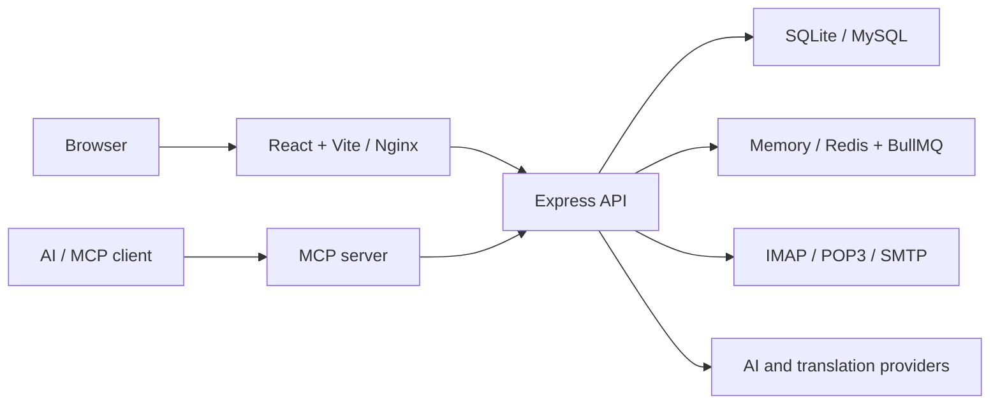

<p align="center">
  
</p>

<h1 align="center">Submail</h1>

<p align="center"><strong>A self-hosted unified inbox for humans and AI agents.</strong></p>

<p align="center">Connect the mailboxes you already use, manage them from one Web UI, and expose carefully scoped email tools through MCP and HTTP.</p>

<p align="center">
  <a href="README.md">English</a> · <a href="README.zh-CN.md">简体中文</a>
</p>

<p align="center">
  <a href="https://github.com/guozhijian611/submail/actions/workflows/ci.yml"></a>
  
  
  
  
</p>

<p align="center">
  <a href="#why-submail">Why Submail</a> ·
  <a href="#screenshots">Screenshots</a> ·
  <a href="#quick-start">Quick start</a> ·
  <a href="#mcp-and-send-api">MCP & API</a> ·
  <a href="#security-model">Security</a>
</p>


> [!NOTE]
> Submail is not a mail server and does not replace Gmail, Outlook, QQ Mail, or your existing provider. It connects existing IMAP/POP3 mailboxes, sends through their SMTP servers, and gives people and agents one controlled workspace.

## Why Submail

| | |
| --- | --- |
| **One inbox, many accounts** | Search, read, reply, forward, star, archive, delete, and manage attachments across multiple mailboxes. |
| **Built for agents** | Use local stdio MCP, remote Streamable HTTP MCP, or a direct HTTP send API without maintaining separate integrations. |
| **Permissioned by default** | Scope every key by capability, mailbox, expiry time, and daily send quota. New keys start with read-only permissions. |
| **Your data, your deployment** | Run locally with SQLite or deploy with Docker, Redis/BullMQ, and SQLite or MySQL. |

## Features

- **Mail accounts:** IMAP or POP3 receive, SMTP send, connection tests, provider presets, app-password guidance, and verified Send As aliases.
- **Incremental sync:** IMAP UID and POP3 UIDL cursors, scheduled jobs, bounded retries, concurrency limits, and sync history.
- **Unified workflow:** Inbox, sent, drafts, starred, archived, trash, conversation threading, advanced search, and bulk actions.
- **Attachments:** Centralized storage after sync, on-demand browser retrieval, `.eml` parsing, retention settings, and broad in-browser preview support.
- **AI assistance:** OpenAI-compatible providers for summaries, suggested replies, and email composition. Generated content is placed in the editor and is never sent automatically.
- **Translation:** Google-compatible, LibreTranslate, or custom HTTP providers with long-message chunking.
- **MCP and API:** Eight MCP tools plus a direct send endpoint, sharing the same authorization and delivery service.
- **Operations:** Health checks, least-privilege containers, durable Redis queues, audit retention, SQLite online backup, and atomic restore.

## Screenshots

<table>
  <tr>
    <td width="50%">
      
      <br><strong>MCP and API access</strong><br>Account scopes, capability scopes, expiry, and daily send limits.
    </td>
    <td width="50%">
      
      <br><strong>AI-assisted composer</strong><br>Draft with AI, review the result, then decide whether to send.
    </td>
  </tr>
</table>

All screenshots use a temporary SQLite database and synthetic `.local` addresses. No production mailbox data is included.

## Quick start

### Docker deployment

Install Docker Engine with the Compose plugin, then run:

```bash
git clone https://github.com/guozhijian611/submail.git
cd submail
./deploy.sh
```

The setup script lets you choose SQLite, bundled MySQL, or external MySQL. It generates secrets, starts Redis and all services, builds the images, and waits for health checks.

The gateway binds to `127.0.0.1:8080` by default. Put Caddy, Nginx, Traefik, or a load balancer with HTTPS in front of it before exposing Submail to the internet.

See the full [deployment and operations guide](docs/deployment.md) for first-admin setup, database modes, backup/restore, and upgrades.

### Local development

Requirements: Node.js 22+.

```bash
npm ci
npm run secure:local
npm run dev
```

- Web UI: `http://localhost:5173`
- API: `http://localhost:8787`
- Local database: `apps/api/data/submail.sqlite`
- Queue: in-memory by default; set `SUBMAIL_QUEUE_DRIVER=redis` and `SUBMAIL_REDIS_URL` to test Redis

`npm run secure:local` creates an `apps/api/.env` file with mode `600` and a dedicated master key. If an older local database still uses the development key, the script backs it up and re-encrypts stored mailbox and integration credentials without printing secrets.

Quality checks:

```bash
npm run typecheck
npm test
npm run build
```

## MCP and send API

Create a key in **Settings → MCP & Admin**, select its scopes and allowed mailboxes, then use the remote endpoint:

```text
https://mail.example.com/mcp
```

Every request carries the key:

```http
Authorization: Bearer sk_submail_xxx
```

Available tools:

| Group | Tools |
| --- | --- |
| Read | `list_accounts`, `search_mail`, `read_mail` |
| Send | `send_mail` |
| AI | `summarize_mail`, `draft_reply`, `compose_mail` |
| Translation | `translate_mail` |

Local stdio mode:

```bash
SUBMAIL_API_URL=http://127.0.0.1:8787 \
SUBMAIL_MCP_API_KEY=sk_submail_xxx \
npm run dev:mcp
```

Direct send API:

```bash
curl --fail-with-body 'https://mail.example.com/api/send' \
  -H 'Authorization: Bearer sk_submail_xxx' \
  -H 'Content-Type: application/json' \
  -H 'Idempotency-Key: order-20260710-0001' \
  --data '{
    "accountId": "mailbox-account-id",
    "to": ["receiver@example.com"],
    "subject": "Hello from Submail",
    "text": "Sent through the Submail API"
  }'
```

The API supports text, HTML, CC/BCC, attachments, thread headers, idempotency keys, and optional verified aliases. MCP `send_mail` uses the same delivery path.

## Security model

> [!IMPORTANT]
> Email and attachments are untrusted input. Deploy behind HTTPS, grant the smallest possible scopes, keep send quotas low, and use app-specific mailbox passwords whenever the provider supports them.

- Mailbox credentials and third-party API keys are encrypted at rest with AES-GCM using `SUBMAIL_SECRET`.
- Admin passwords and MCP/API keys are stored as one-way hashes; a new key is displayed only once.
- Keys can be restricted by capability, mailbox, expiry, and daily send quota.
- AI output never sends automatically; it enters the composer for human review.
- Audit logs record metadata rather than message bodies, prompts, email addresses, attachment Base64, or idempotency keys.
- `SUBMAIL_SECRET` is tied to encrypted data. Back it up separately and never rotate it casually after storing credentials.

Please report vulnerabilities privately through [GitHub Security Advisories](../../security/advisories/new). Read [SECURITY.md](SECURITY.md) before reporting.

## Architecture



| Path | Responsibility |
| --- | --- |
| `apps/web` | React mail client and administration UI |
| `apps/api` | Authentication, mail sync/send, storage, queueing, AI, translation, backup and restore |
| `apps/mcp` | stdio and Streamable HTTP MCP transports |
| `scripts` | Local secret hardening and real-provider integration checks |
| `tests` | API, POP3, HTTP MCP, runtime-lock, and restore integration tests |
| `docs` | Deployment operations and feature-gap documentation |

## Current boundaries

- IMAP can read INBOX and the provider's public Sent folder; POP3 can read INBOX only.
- Read, star, archive, and delete state is currently local and is not written back to IMAP.
- Gmail and Microsoft OAuth, DKIM signing, DSN bounce processing, and a queue dashboard are not implemented yet.
- SQLite and MySQL data are not automatically migrated between drivers.
- The default free Google translation path is best-effort and is not appropriate for confidential email or strict SLAs.

The detailed implementation review and roadmap live in [docs/gap-review.md](docs/gap-review.md).

## Contributing

Issues and pull requests are welcome. Start with [CONTRIBUTING.md](CONTRIBUTING.md), keep changes focused, and include the relevant tests or rendered UI evidence.

## Project status and licensing

Submail is an early-stage `0.1.x` project. A project-wide license has not yet been selected because optional document-viewer dependencies include components with copyleft licenses. Public repository access does not grant redistribution rights until a `LICENSE` file is added; dependency licenses continue to apply independently.
