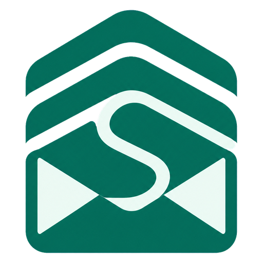
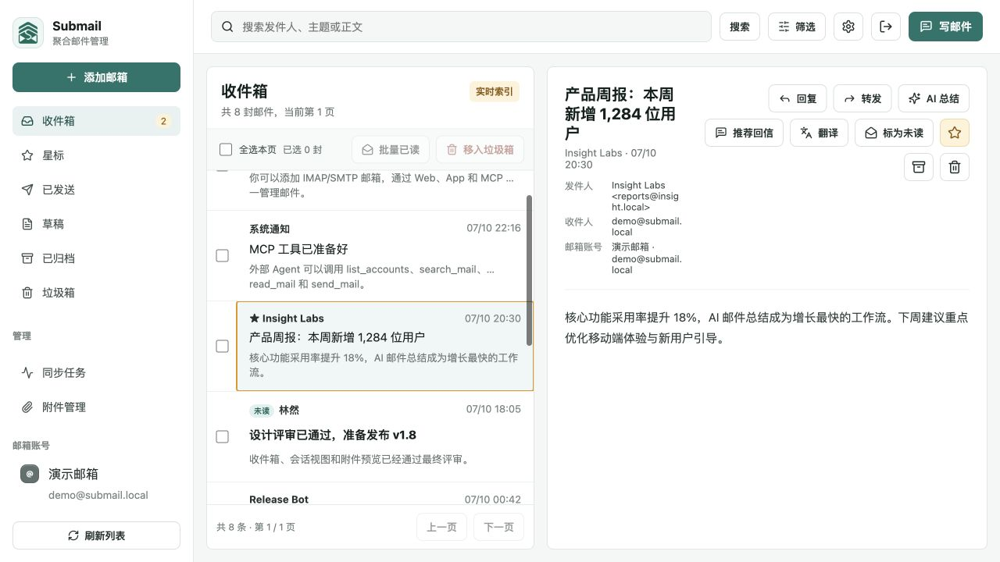
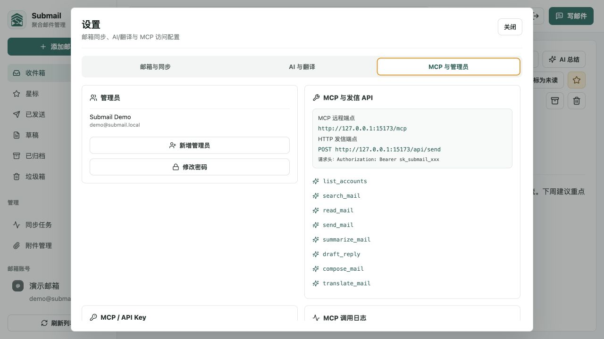
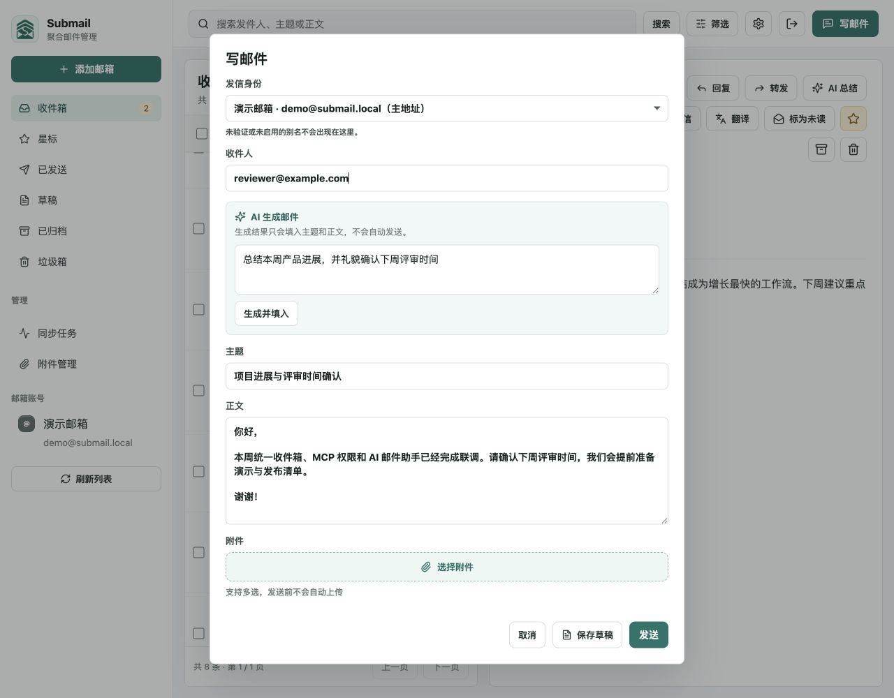

<p align="center">
  
</p>

<h1 align="center">Submail</h1>

<p align="center"><strong>为人和 AI Agent 准备的自托管多邮箱聚合工作台。</strong></p>

<p align="center">连接你已经在用的邮箱，在一个 Web 界面中集中管理，并通过可细粒度授权的 MCP 和 HTTP API 向 Agent 开放能力。</p>

<p align="center">
  <a href="README.md">English</a> · <a href="README.zh-CN.md">简体中文</a>
</p>

<p align="center">
  <a href="https://github.com/guozhijian611/submail/actions/workflows/ci.yml"></a>
  
  
  
  
</p>



> [!NOTE]
> Submail 不是邮件服务器，也不会替代 Gmail、Outlook、QQ 邮箱或现有服务商。它通过 IMAP / POP3 连接现有邮箱，使用该邮箱的 SMTP 发信，为人和 Agent 提供同一个受控工作台。

## 为什么是 Submail

| | |
| --- | --- |
| **一个收件箱，多个账号** | 跨邮箱搜索、阅读、回复、转发、星标、归档、删除和管理附件。 |
| **Agent 原生** | 同时提供本地 stdio MCP、远程 Streamable HTTP MCP 和直接 HTTP 发信 API。 |
| **默认最小权限** | 每把 Key 都可限制能力、邮箱、有效期和每日发信量；新 Key 默认只读。 |
| **数据自己掌控** | 本地使用 SQLite，或通过 Docker + Redis/BullMQ + SQLite/MySQL 自托管部署。 |

## 产品截图

<table>
  <tr>
    <td width="50%">
      
      <br><strong>MCP 与 API 访问控制</strong><br>账号范围、能力 Scope、有效期和每日发信上限。
    </td>
    <td width="50%">
      
      <br><strong>AI 辅助写信</strong><br>AI 只会把结果填入编辑器，由人工确认是否发送。
    </td>
  </tr>
</table>

全部截图使用临时 SQLite 数据库和虚构的 `.local` 地址，不包含真实邮箱数据。

## 已有能力

- **多邮箱管理：**新增、编辑、删除、备注、IMAP/POP3/SMTP 连接测试；常见邮箱服务商参数推荐；已验证 Send As 别名。
- **增量同步：**IMAP UID 与 POP3 UIDL 游标、远端已读/星标状态对账、特殊目录发现、定时任务、有限重试、并发限制和同步记录。
- **集中处理：**统一收件箱、已发送、草稿、星标、归档、垃圾箱、会话聚合、高级搜索和批量操作。
- **附件：**同步后集中存储，浏览器仅在打开预览或下载时请求附件内容；支持 `.eml` 解析、保留策略和多种格式在线预览。
- **AI 邮件助手：**支持 OpenAI-compatible 服务，可总结邮件、推荐回信和生成邮件；结果不会自动发送。
- **翻译：**Google-compatible、LibreTranslate 或自定义 HTTP 服务，长邮件自动分块。
- **MCP 与 API：**8 个 MCP 工具与 HTTP 发信 API 共用同一套授权与投递服务。
- **运维：**Docker Compose 一键部署、Redis 持久化队列、健康检查、SQLite 在线备份与原子恢复。

## 快速开始

### Docker 部署

服务器安装 Docker Engine 和 Compose 插件后执行：

```bash
git clone https://github.com/guozhijian611/submail.git
cd submail
./deploy.sh
```

脚本会让你选择 SQLite、Compose 内置 MySQL 或外部 MySQL，随后生成随机密钥、启动 Redis 和全部服务、构建镜像并等待健康检查。

默认只在 `127.0.0.1:8080` 暴露同源网关。请在公网前配置 Caddy、Nginx、Traefik 或负载均衡的 HTTPS。

完整说明见 [部署与运维文档](docs/deployment.md)。

### 本地开发

需要 Node.js 22+：

```bash
npm ci
npm run secure:local
npm run dev
```

- Web：`http://localhost:5173`
- API：`http://localhost:8787`
- SQLite：`apps/api/data/submail.sqlite`
- 本地队列：默认 `memory`

常用检查：

```bash
npm run typecheck
npm test
npm run build
```

## MCP 与发信 API

在“设置 → MCP 与管理员”中创建 Key，选择 Scope 和可访问邮箱，然后访问：

```text
https://mail.example.com/mcp
```

```http
Authorization: Bearer sk_submail_xxx
```

| 分组 | 工具 |
| --- | --- |
| 读取 | `list_accounts`、`search_mail`、`read_mail` |
| 发信 | `send_mail` |
| AI | `summarize_mail`、`draft_reply`、`compose_mail` |
| 翻译 | `translate_mail` |

本地 stdio 模式：

```bash
SUBMAIL_API_URL=http://127.0.0.1:8787 \
SUBMAIL_MCP_API_KEY=sk_submail_xxx \
npm run dev:mcp
```

HTTP 发信示例：

```bash
curl --fail-with-body 'https://mail.example.com/api/send' \
  -H 'Authorization: Bearer sk_submail_xxx' \
  -H 'Content-Type: application/json' \
  -H 'Idempotency-Key: order-20260710-0001' \
  --data '{
    "accountId": "邮箱账号ID",
    "to": ["receiver@example.com"],
    "subject": "来自 Submail 的测试邮件",
    "text": "通过 Submail API 发送"
  }'
```

## 安全模型

> [!IMPORTANT]
> 邮件和附件都是不可信输入。请部署在 HTTPS 后面、使用最小权限 Scope、设置较低发信限额，并优先使用邮箱服务商的应用专用密码。

- 邮箱凭据和第三方 API Key 使用 `SUBMAIL_SECRET` 进行 AES-GCM 加密。
- 管理员密码和 MCP/API Key 只保存不可逆 Hash，新 Key 只展示一次。
- Key 可按能力、邮箱、有效期和每日发信额度限制。
- AI 结果只进入编辑器，不会自动发送。
- `SUBMAIL_SECRET` 与已加密数据绑定，必须单独备份，产生业务数据后不能随意更换。

安全问题请通过 [GitHub Security Advisories](../../security/advisories/new) 私密报告，不要提交公开 Issue。详见 [SECURITY.md](SECURITY.md)。

## 当前边界

- IMAP 会同步 INBOX 以及服务商可发现的 Sent、Drafts、Trash、Archive 特殊目录，并对账远端已读/星标状态；Gmail 可用时从 All Mail 标签识别已归档邮件。POP3 仍只能读取收件箱。
- 已读、星标、归档、删除等状态目前只保存在本地，不回写 IMAP。
- 尚未支持 Gmail/Microsoft OAuth、DKIM 签名、DSN 退信和队列面板。
- SQLite 与 MySQL 之间不会自动迁移已有数据。
- 默认免 Key Google 翻译为 best-effort 第三方服务，不适合机密邮件或严格 SLA。

完整实现复盘与路线见 [docs/gap-review.md](docs/gap-review.md)。

## 贡献、项目状态与许可证

欢迎 Issue 和 Pull Request。请先阅读 [CONTRIBUTING.md](CONTRIBUTING.md)，保持改动范围聚焦，并补充相关测试或界面验证证据。

Submail 目前是早期 `0.1.x` 项目。由于可选文档预览依赖中包含 copyleft 组件，项目级许可证尚在评估中。在添加 `LICENSE` 文件前，公开访问不代表授予再分发权；各依赖自身许可证仍独立生效。
